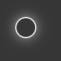

# vue-animated-cursor
VueJS animated cursor with light halo

## Install
```shell
npm install --save vue-animated-cursor
```

## Usage
Just import the `AnimatedCursor` component anywhere on your page !

```html
<template>
    <AnimatedCursor />
</template>

<script>
	import AnimatedCursor from 'vue-animated-cursor'

	export default {
		components: {
			AnimatedCursor
		}
	}
</script>
```

## Screenshot

